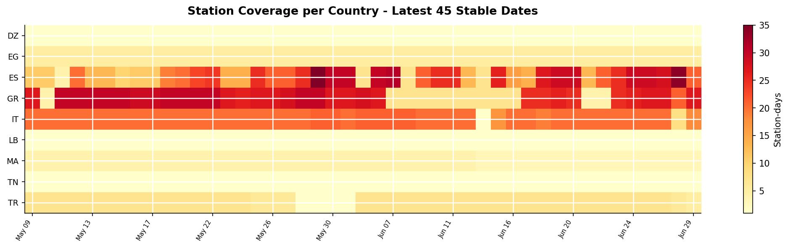
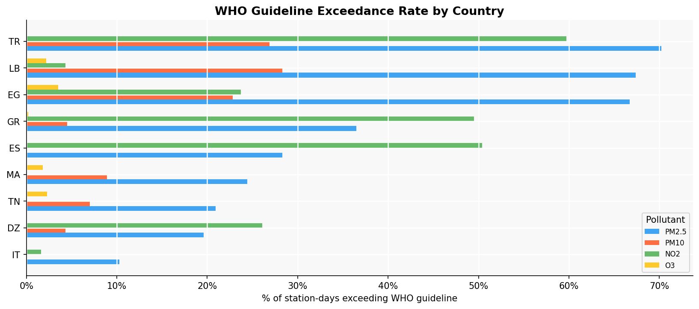
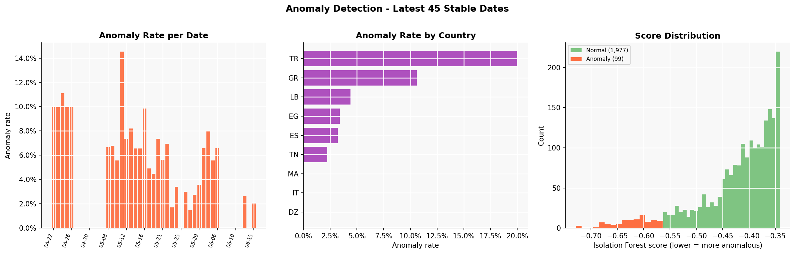
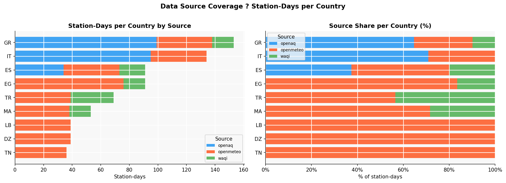

# Mediterranean Ops Fortress

[](https://github.com/ReguiguiMohamed/mediterranean-ops-fortress/actions/workflows/ci-data.yml)
[](https://github.com/ReguiguiMohamed/mediterranean-ops-fortress/actions/workflows/ci-infra.yml)
[](https://github.com/ReguiguiMohamed/mediterranean-ops-fortress/actions/workflows/cd-deploy.yml)
[](https://github.com/ReguiguiMohamed/mediterranean-ops-fortress/actions/workflows/pipeline-run.yml)

Mediterranean Ops Fortress is a hybrid Data Engineering and DevOps portfolio
project built around real Mediterranean air quality data. It ingests public API
data, writes a Delta Lake medallion on Backblaze B2, validates quality,
builds analytics Gold marts including ML-based anomaly detection, and pushes
full pipeline observability to a live Grafana Cloud dashboard via Prometheus
remote_write.

This is not a tutorial scaffold. The stack is designed to behave like a small
production data platform: real public APIs, incremental Delta writes, CI
validation, hosted metrics, alert rules, and no synthetic fallback data.

## What It Does

The platform pulls three real public data sources:

| Source | Data | Notes |
|---|---|---|
| Open-Meteo Air Quality API | CAMS-backed daily PM2.5, PM10, NO2, and O3 means for 12 Mediterranean city grid points | Free, no API key |
| OpenAQ v3 | Station observations for TN, DZ, MA, EG, TR, GR, ES, IT, and LB | Free API; API key recommended (register free at openaq.org); daily aggregates via `/v3/sensors/{id}/measurements/daily` |
| WAQI (World Air Quality Index) | Current station readings for 15 city queries across LB, MA, TN, DZ, EG, TR, GR, ES, IT | Free API token (register at aqicn.org/data-platform/token/); fills LB and MA gaps left by OpenAQ sparsity |

The pipeline writes:

| Layer | Path | Purpose |
|---|---|---|
| Bronze | `s3://bronze/openmeteo/air_quality` | Open-Meteo gridded source records, partitioned by `partition_date` |
| Bronze | `s3://bronze/openaq/air_quality` | OpenAQ station records, partitioned by `partition_date` |
| Bronze | `s3://bronze/waqi/air_quality` | WAQI station records, partitioned by `partition_date` |
| Silver | `s3://silver/air_quality` | Canonical cleaned rows with WHO flags, AQI category, completeness, source, and partition date |
| Gold | `s3://gold/daily_country_summary` | Daily country/source pollutant summaries and WHO exceedance percentages |
| Gold | `s3://gold/wildfire_risk_index` | Composite O3 + PM2.5 station risk index (0–100 score) |
| Gold | `s3://gold/anomaly_alerts` | Isolation Forest anomaly flags per station per day (PM2.5, O3, NO2 features) |

## Pipeline Output

Charts generated from live Gold tables on Backblaze B2. See
[`docs/pipeline_report.ipynb`](docs/pipeline_report.ipynb) or the rendered
[`docs/pipeline_report.html`](docs/pipeline_report.html) for the full analysis.
This reporting surface is regenerated automatically each day after the scheduled
pipeline run completes successfully.
The report also writes `docs/reporting_readiness.csv` and excludes
coverage-shifted fresh partitions from public charts until their station/source
mix is comparable with the recent reporting baseline.

**Station coverage — country × date**


**WHO guideline exceedance rates by country**


**Anomaly detection — Isolation Forest results**


**Data source coverage — station-days per country per source**


## Architecture

See [docs/architecture.md](docs/architecture.md) for the full architecture document
with a Mermaid data flow diagram, medallion schema, and observability model.

```text
Open-Meteo ----\
OpenAQ v3 ------+--> Bronze --> Silver --> Gold (marts + anomaly detection)
WAQI ----------/

        Backblaze B2 (Delta Lake / S3-compat, eu-central-003)

Jobs --> remote_write --> Grafana Cloud (Mimir) --> Dashboards + Alerts
```

## Canonical Silver Schema

All downstream code uses these columns:

```text
station_id, station_name, city, country_code, latitude, longitude, date,
pm2_5, pm10, nitrogen_dioxide, ozone, aqi_category,
who_pm25_exceed, who_pm10_exceed, who_no2_exceed, who_o3_exceed,
data_completeness, source, silver_ts, partition_date
```

Column names are intentionally explicit: use `pm2_5`, `nitrogen_dioxide`, and
`ozone`; do not introduce aliases such as `pm2p5`, `no2`, or `o3`.

## Stack

| Domain | Tools |
|---|---|
| Storage | Backblaze B2 (S3-compatible, `eu-central-003`), Delta Lake, delta-rs |
| Local dev storage | MinIO `RELEASE.2025-09-07T16-13-09Z` (via docker-compose override) |
| Data pipeline | Python 3.11, pandas, pyarrow, deltalake |
| Transformation | Bronze → Silver → Gold Python jobs |
| ML | scikit-learn `IsolationForest` — anomaly detection on Silver PM2.5 / O3 / NO2 |
| Quality | Custom Great Expectations-backed data quality runner and schema validation |
| Observability | Grafana Cloud (`mohamedwillforge.grafana.net`) — Prometheus remote_write to Mimir, hosted dashboards and alert rules |
| Local observability | Prometheus `v2.51.0`, Pushgateway, Alertmanager `v0.27.0`, cAdvisor (docker-compose) |
| CI/CD | GitHub Actions (6 workflows), ghcr.io image publishing, automated report refresh |

## Repository Layout

```text
mediterranean-ops-fortress/
|-- .github/workflows/
|   |-- ci-data.yml          # lint, unit tests, integration tests
|   |-- ci-infra.yml         # prometheus config and alert rule validation
|   |-- cd-deploy.yml        # ghcr.io image publishing
|   |-- pipeline-run.yml     # daily cron + manual run against real B2
|   |-- update-report.yml    # regenerates notebook, HTML, PNGs after pipeline success
|   `-- verify-secrets.yml   # lightweight credential probe (B2 + Grafana)
|-- data/
|   |-- ingestion/
|   |   |-- bronze/
|   |   |   |-- base.py
|   |   |   |-- copernicus_ingestor.py   # Open-Meteo Air Quality source
|   |   |   |-- openaq_ingestor.py
|   |   |   `-- waqi_ingestor.py         # WAQI — fills LB/MA coverage gaps
|   |   |-- silver/transformer.py
|   |   `-- gold/
|   |       |-- marts.py                 # daily_country_summary + wildfire_risk_index
|   |       `-- anomaly.py               # Isolation Forest anomaly_alerts
|   |-- metrics.py                       # Grafana Cloud remote_write helper
|   |-- quality/
|   `-- schemas/
|-- docker/
|   |-- docker-compose.yml           # base stack
|   |-- docker-compose.override.yml  # local dev — adds MinIO
|   |-- ingestion/Dockerfile
|   `-- quality/Dockerfile
|-- docs/
|   |-- architecture.md
|   |-- pipeline_report.ipynb   # live analysis notebook (reads from B2 Gold)
|   |-- pipeline_report.html    # rendered static report
|   |-- coverage_heatmap.png
|   |-- who_exceedance.png
|   |-- wildfire_risk.png
|   |-- pollutants_by_country.png
|   |-- anomaly_detection.png
|   `-- source_coverage.png
|   `-- adr/001-lakehouse-format.md
|-- grafana/
|   |-- dashboards/pipeline_observability.json  # live Grafana Cloud dashboard (v2 format)
|   `-- alerts/pipeline_alerts.yaml             # alert rule reference (3 rules)
|-- monitoring/
|   |-- prometheus/          # local dev Prometheus config + alert rules
|   `-- alertmanager/        # local dev Alertmanager config (webhook stubs)
|-- tests/
|   |-- unit/
|   |-- integration/
|   `-- ci_verify_silver.py / ci_verify_gold.py
|-- .env.example
|-- Makefile
`-- README.md
```

The Open-Meteo module is named `copernicus_ingestor.py` because the source is
CAMS-backed model data. The persisted source label and storage path are `openmeteo`.

## Quick Start

### Prerequisites

| Tool | Version | Purpose |
|---|---|---|
| Docker | 24+ | Compose stack and pipeline job containers |
| Python | 3.11 | Local tests and development |

### Configure

```bash
git clone https://github.com/ReguiguiMohamed/mediterranean-ops-fortress.git
cd mediterranean-ops-fortress
cp .env.example .env
```

Open-Meteo requires no API key. An OpenAQ API key is optional but recommended
(anonymous tier has very low rate limits). Register free at
[explore.openaq.org/register](https://explore.openaq.org/register) and set
`OPENAQ_API_KEY` in your `.env`.

A WAQI API token is required for the third Bronze source. Register free at
[aqicn.org/data-platform/token/](https://aqicn.org/data-platform/token/) and set
`WAQI_API_KEY` in your `.env` (or as a GitHub secret for CI).

---

### Local Development

Bring up the local observability stack (Prometheus, Pushgateway, Alertmanager, cAdvisor):

```bash
make monitoring-up
```

To run pipeline jobs locally with MinIO as the lakehouse backend:

```bash
make up          # starts MinIO + observability stack
make ingest      # Open-Meteo, OpenAQ, WAQI, Silver, Gold, anomaly
make quality     # recent-partition quality checks
```

WAQI requires `WAQI_API_KEY`; without it the WAQI stage logs a warning and
skips. The scheduled GitHub pipeline is the canonical production-style path
against Backblaze B2.

Access the local stack:

| Service | URL |
|---|---|
| MinIO console | http://localhost:9001 (minioadmin / minioadmin) |
| Prometheus | http://localhost:9090 |
| Alertmanager | http://localhost:9093 |
| Pushgateway | http://localhost:9091 |

Grafana dashboards are hosted on [Grafana Cloud](https://mohamedwillforge.grafana.net) —
the live dashboard is not part of the local stack.

---

### Run Against Backblaze B2

Set credentials in `.env` (create an Application Key at backblaze.com) when
running Python modules directly against B2:

```bash
export MINIO_ENDPOINT=https://s3.eu-central-003.backblazeb2.com
export MINIO_ACCESS_KEY=<b2-key-id>
export MINIO_SECRET_KEY=<b2-application-key>
python -m data.ingestion.silver.transformer
```

Or trigger `pipeline-run.yml` from the GitHub Actions tab (requires `B2_KEY_ID`
and `B2_APP_KEY` as repository secrets). This is the preferred full B2 run path.

---

### Run Tests Locally

```bash
make lint        # ruff + black check
make test        # all pytest tests
```

Integration tests require a live MinIO or B2 endpoint.

---

## Observability

Pipeline jobs push metrics to **Grafana Cloud** (`mohamedwillforge.grafana.net`)
via Prometheus remote_write after every stage. The `data/metrics.py` helper
handles protobuf encoding, Snappy compression, and Basic Auth. It is a
silent no-op when `GRAFANA_*` env vars are absent, so local dev is unaffected.

Each stage pushes flat, stage-specific Prometheus metrics. Flat names (no shared
metric name with label dimensions) are required by Grafana Cloud free-tier
per-series limits:

| Metric | Stage | Purpose |
|---|---|---|
| `med_ops_bronze_openmeteo_rows` | Bronze Open-Meteo | Row count written per run |
| `med_ops_bronze_openaq_rows` | Bronze OpenAQ | Row count written per run |
| `med_ops_silver_rows` | Silver | Row count written per run |
| `med_ops_gold_mart_rows` | Gold marts | Total rows across both Gold marts |
| `med_ops_gold_anomaly_rows` | Gold anomaly | Rows processed by Isolation Forest |
| `med_ops_gold_anomaly_flags` | Gold anomaly | Anomalous readings flagged |
| `med_ops_{stage}_last_run_ts` | All stages | Unix timestamp of last successful run |
| `med_ops_{stage}_duration_seconds` | All stages | Wall-clock seconds per stage |
| `med_ops_bronze_{src}_quality_failures_total` | Bronze | Data quality gate failures |
| `med_ops_silver_quality_failures_total` | Silver | Data quality gate failures |

Dashboard queries use `last_over_time(metric[25h])` on all stat panels so values
persist through the day after a single daily push.

**Dashboard:** `grafana/dashboards/pipeline_observability.json` (Grafana v2 API
format, datasource `grafanacloud-prom`). Import via Grafana Cloud UI:
Dashboards → New → Import.

**Alert rules** (`grafana/alerts/pipeline_alerts.yaml`) — three managed rules:
pipeline stale >25 h (critical), OpenAQ 0 rows (warning), quality failure (warning).
Create via Alerting → Alert rules → New alert rule using the PromQL expressions
in the YAML file.

Local dev retains Prometheus, Pushgateway, and Alertmanager via `docker/docker-compose.yml`.
Alertmanager routing is defined in `monitoring/alertmanager/alertmanager.yml` with
webhook stubs — local dev does not send real alerts.

## CI/CD

| Workflow | Triggers | What It Checks |
|---|---|---|
| `ci-data.yml` | Push/PR on `data/**`, `tests/**`, `docker/**` | ruff, black, unit tests, Docker builds, MinIO integration, Silver/Gold assertions |
| `ci-infra.yml` | Push/PR on `monitoring/**` | promtool validates prometheus.yml and alert rules; amtool validates alertmanager config |
| `cd-deploy.yml` | Push to `main` on `docker/**`, `data/ingestion/**` | Builds and pushes versioned images to ghcr.io |
| `pipeline-run.yml` | Daily cron (06:00 UTC) + manual (`workflow_dispatch`) | Runs Bronze → Silver → Gold → Anomaly against real B2; supports single-date and date-range backfill; pushes metrics to Grafana Cloud when `GRAFANA_*` secrets are set |
| `update-report.yml` | After successful `pipeline-run.yml` + manual (`workflow_dispatch`) | Executes the report notebook, renders HTML, and commits refreshed report artifacts |
| `verify-secrets.yml` | Manual (`workflow_dispatch`) | Probes B2 and Grafana Cloud credentials without touching data (~30 s) |

Pinned linting versions:

```text
ruff==0.15.10
black==26.3.1
```

## Known Limitations

- **OpenAQ v3 data sparsity:** The ingestor fetches up to 50 stations per
  country (hard cap to prevent rate-limit flooding on high-density countries
  like TN/DZ/MA which have 1,000+ stations). Most OpenAQ v3 stations have no
  pre-aggregated daily data for recent dates — this is upstream sparsity, not a
  pipeline bug. A typical daily run returns ~20–50 rows from 500 sensor queries.
- **OpenAQ API key:** The `/v3/sensors/{id}/measurements/daily` endpoint works
  without a key but enforces anonymous-tier rate limits. Set `OPENAQ_API_KEY` in
  `.env` (or as a GitHub Actions secret) to use standard free-tier limits.
  Integration tests skip OpenAQ gracefully when the ingestor returns 0 rows.
- **B2 Class B (download) transaction cap:** Backblaze B2's free tier allows
  2,500 Class B transactions per day. Delta Lake checkpoints are created after
  every write (`create_checkpoint()`) so each `DeltaTable()` open costs a fixed
  2 Class B regardless of table history. A steady-state daily run uses ~50–100
  transactions. Backfills over more than ~20 dates should be split across days
  to avoid hitting the cap. The pipeline fails fast with a 403 when the cap is
  reached — it does not silently retry or skip.
- **B2 storage auth:** The pipeline uses Backblaze B2 Application Keys for
  S3-compatible access. Create an Application Key at the Backblaze console and
  set `B2_KEY_ID` / `B2_APP_KEY` as GitHub Actions secrets before triggering
  `pipeline-run.yml`.
- **Grafana Cloud free tier metric series limit:** Mimir silently drops series
  beyond the first unique combination per metric name. All metrics use flat
  per-stage names (e.g. `med_ops_silver_rows`) rather than shared names with
  label dimensions to stay within the free-tier limit.
- **Static report freshness:** WAQI is a current-readings source and upstream
  station coverage can shift on the freshest partition. Public report charts use
  anomaly rates rather than raw anomaly counts and exclude coverage-shifted dates
  flagged in `docs/reporting_readiness.csv`; the lake still keeps all real rows.
- **Local dev alerting:** `monitoring/alertmanager/alertmanager.yml` uses
  `localhost:5001` webhook stubs — local dev does not send real alerts. Grafana
  Cloud contact points handle production alerting.
- **Image digest pinning:** Docker image tags are pinned to specific versions
  (including `python:3.11.15-slim`), but not to SHA-256 digests. Tag pinning
  protects against `:latest` drift; digest pinning would add supply-chain
  protection against tag rewrites and is deferred.
- **No Kubernetes, secrets manager, or production SLAs.**
- **No paid managed-service dependency.** Grafana Cloud is useful while the free
  plan is available, but static repo-owned charts and reports remain the durable
  portfolio surface.

## Design Rules

- Real APIs only. No synthetic data fallbacks.
- Delta writes use `engine="rust"` when `schema_mode="merge"` is set.
- `create_checkpoint()` is called after every `write_deltalake()` to keep Class B reads at O(1).
- Pushgateway and Grafana remote_write pushes are best-effort and wrapped in `try/except`.
- Bronze idempotency and Silver incremental processing are partition-based.
- Canonical Silver schema and source labels (`openmeteo`, `openaq`, `waqi`) are frozen.
- Public analytics should be understandable without Grafana Cloud; prefer static
  charts in `docs/` with clear titles, rates, and coverage diagnostics.
- Commits are clean: no AI co-author lines.

## Acknowledgements

Data sources:

- [Open-Meteo](https://open-meteo.com/) Air Quality API, backed by CAMS model data
- [OpenAQ](https://openaq.org/) open air quality data platform
- [WAQI](https://waqi.info/) World Air Quality Index

## A Note on Construction

This project was built in close collaboration with Claude (Anthropic). The philosophical question of what that means for authorship is not very interesting. Tools have always shaped what builders can build and the question was never the hammer, it was the will behind it. The decisions made here, what to build, what to reject, what to hold the line on, were human. Claude wrote much of the implementation. The judgment of what mattered and why remained mine.
