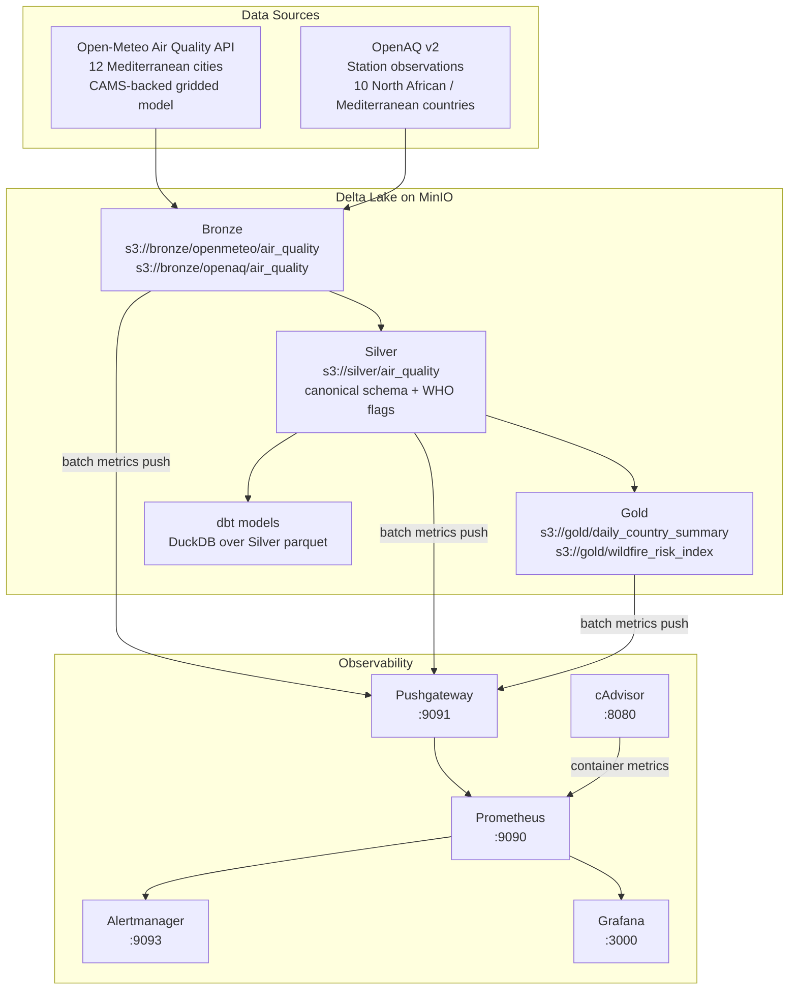

# Architecture - Mediterranean Ops Fortress

## System Overview

Mediterranean Ops Fortress combines reproducible local infrastructure, a Delta
Lake medallion data pipeline, dbt analytics models, and full pipeline
observability. The current data domain is real Mediterranean air quality sourced
from public APIs only.



## Data Flow

```text
Open-Meteo Air Quality API
  CAMS-backed gridded PM2.5, PM10, NO2, O3 for 12 cities
        |
        v
Bronze Delta tables on MinIO           partition_date / source partitioned
        |
        v
Silver canonical air_quality table     cleaning, typing, WHO 2021 exceedance
  flags, AQI category, completeness    flags, AQI category, completeness
        |
        +---> dbt models (DuckDB over Silver parquet on MinIO)
        |
        v
Gold Delta marts
  daily_country_summary                country/source aggregates + WHO pct
  wildfire_risk_index                  composite O3 + PM2.5 risk score

OpenAQ v2 API
  station observations for TN, DZ, MA, LY, EG, TR, GR, ES, IT, LB
        |
        `-- same Bronze -> Silver -> Gold path
```

Every pipeline stage pushes batch metrics to Pushgateway after completion.
Prometheus scrapes Pushgateway, cAdvisor (container metrics), MinIO, and itself.
Grafana visualizes freshness, row counts, quality failures, stage duration, and
infrastructure health. Alertmanager routes firing alerts into intent-driven groups.

## Medallion Architecture

| Layer | Location | Content | Format |
|---|---|---|---|
| Bronze | `s3://bronze/openmeteo/air_quality` | Open-Meteo CAMS-backed gridded records, append-only, partitioned by `partition_date` | Delta Lake |
| Bronze | `s3://bronze/openaq/air_quality` | OpenAQ station observations, append-only, partitioned by `partition_date` | Delta Lake |
| Silver | `s3://silver/air_quality` | Canonical cleaned rows with WHO flags, AQI category, completeness, source, and partition date | Delta Lake |
| Gold | `s3://gold/daily_country_summary` | Daily country/source pollutant aggregates and WHO exceedance percentages | Delta Lake |
| Gold | `s3://gold/wildfire_risk_index` | Composite O3 plus PM2.5 risk index per station and day | Delta Lake |

## Canonical Silver Schema

All downstream code expects these columns:

```text
station_id, station_name, city, country_code, latitude, longitude, date,
pm2_5, pm10, nitrogen_dioxide, ozone, aqi_category,
who_pm25_exceed, who_pm10_exceed, who_no2_exceed, who_o3_exceed,
data_completeness, source, silver_ts, partition_date
```

Column names intentionally use `pm2_5`, `nitrogen_dioxide`, and `ozone`.
Downstream code must not introduce aliases such as `pm2p5`, `no2`, or `o3`.

## Infrastructure Layers

### Vagrant

A single Ubuntu 22.04 VM hosts the local stack at `192.168.56.10`. Ports are
forwarded to the host for MinIO, Prometheus, Pushgateway, Grafana, and
Alertmanager.

### Terraform

Three modules manage Docker resources on the VM:

| Module | Responsibility |
|---|---|
| `networking` | Docker bridge network (`med-ops-net`) |
| `storage` | MinIO container, named volume, and bucket initialization via `minio/mc` |
| `compute` | Prometheus, Pushgateway, Grafana, and Alertmanager containers |

The project uses the `kreuzwerker/docker` provider. Provider declarations live
inside each module to avoid falling back to the nonexistent `hashicorp/docker`
provider.

### Ansible

Six roles configure the VM in order:

```text
common -> docker -> minio -> prometheus -> alertmanager -> grafana
```

All observability containers join the shared `med-ops-net` Docker network so
Prometheus can reach targets by service name (`alertmanager:9093`,
`pushgateway:9091`, `minio:9000`). Docker Engine installation uses the
keyring-based `apt` source (not the deprecated `apt_key` flow). A
`node_exporter` container is deployed on the VM and scraped at
`192.168.56.10:9100`.

### Docker Compose

`docker/docker-compose.yml` provides a local alternative without Vagrant.
All images are pinned to verified versions.

Services in the default stack (no `--profile` required):

| Service | Image | Port |
|---|---|---|
| `minio` | `quay.io/minio/minio:RELEASE.2025-09-07T16-13-09Z` | 9000, 9001 |
| `pushgateway` | `prom/pushgateway:v1.8.0` | 9091 |
| `prometheus` | `prom/prometheus:v2.51.0` | 9090 |
| `alertmanager` | `prom/alertmanager:v0.27.0` | 9093 |
| `grafana` | `grafana/grafana-oss:10.4.2` | 3000 |
| `cadvisor` | `gcr.io/cadvisor/cadvisor:v0.49.1` | 8080 |

Profile-gated pipeline jobs (activated with `--profile jobs` or `make ingest`):

| Service | Purpose |
|---|---|
| `ingestion` | Bronze ingestors + Silver transformer + Gold mart builder |
| `quality` | Data quality runner |

Startup order is enforced via healthchecks and `depends_on` conditions:
`pushgateway` healthy before `prometheus` starts; `prometheus` healthy before
`grafana` starts; `minio` healthy before `ingestion` and `quality` start.

## Observability Model

```text
Pipeline jobs -> Pushgateway -> Prometheus -> Grafana
cAdvisor ----------------------^          |
MinIO (metrics endpoint) ------^          v
node_exporter (VM) ------------^    Alertmanager
```

### Pipeline Metrics

| Metric | Labels | Purpose |
|---|---|---|
| `pipeline_ingested_rows` | `layer`, `source` | Row counts per pipeline run |
| `pipeline_last_successful_run_timestamp` | `layer` | Freshness tracking |
| `pipeline_duration_seconds` | `stage` | Stage latency |
| `pipeline_quality_check_failures_total` | `check_name`, `layer` | Quality gate failures |
| `pipeline_schema_drift_events_total` | `table` | Schema evolution events |

### Alert Rules

`infra_alerts.yml` covers: `ContainerDown` (critical), `MinIODown` (critical),
`DiskUsageCritical` (critical), `HighCPUUsage` (warning), `HighMemoryUsage`
(warning).

`pipeline_alerts.yml` covers: `BronzeLayerStale`, `SilverLayerStale`,
`GoldLayerStale`, `QualityChecksStale`, `BronzeRowCountDrop` (all warning),
`DataQualityCheckFailed` (severity `pipeline`), `BronzeIngestSlow`,
`SilverTransformSlow` (warning).

### Alertmanager Routing

Alerts are routed into three intent-driven groups:

| Receiver | Matches | group_wait | repeat_interval |
|---|---|---|---|
| `infra_critical` | `severity=critical` | 10 s | 1 h |
| `pipeline_ops` | `severity=pipeline` or `severity=warning` + layer label | 1–2 m | 2–4 h |
| `infra_ops` | all other warnings | 30 s | 4 h |

Three inhibit rules suppress downstream noise: a `MinIODown` critical event
suppresses all layer-staleness warnings; a `ContainerDown` event suppresses
CPU/memory warnings for the same container; critical severity suppresses the
matching warning-level alert by `alertname`.

Webhook receivers default to `localhost:5001` placeholders. Override via
`ansible/vars/common.yml` before deploying to a real environment.

## CI/CD

| Workflow | Path Triggers | Responsibility |
|---|---|---|
| `ci-data.yml` | `data/**`, `tests/**`, `docker/**` | Python linting, unit tests, dbt compile, Docker builds, MinIO-backed integration tests, Silver/Gold assertions, dbt run+test |
| `ci-infra.yml` | `terraform/**`, `ansible/**`, `monitoring/**` | Terraform format+validate+tflint, Ansible lint, promtool rule checks, amtool check-config |
| `cd-deploy.yml` | `docker/**`, `data/ingestion/**` on `main` | Builds and pushes versioned images to ghcr.io |

The data pipeline CI uses real upstream APIs. OpenAQ v2 may return HTTP 410 for
historical measurement queries; tests skip cleanly when that upstream behavior
leaves no OpenAQ Bronze table to inspect.
