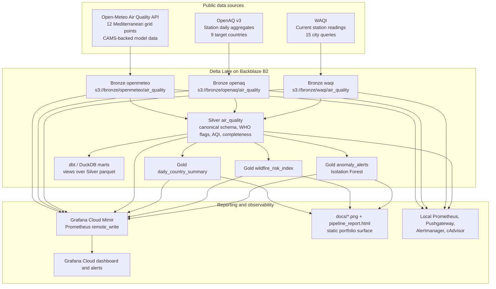

# Architecture - Mediterranean Ops Fortress

## System Overview

Mediterranean Ops Fortress is a real-data air-quality platform for the
Mediterranean and North Africa. It runs a daily batch pipeline against public
APIs, stores Delta Lake medallion tables on Backblaze B2, validates the latest
partitions, builds Gold analytics marts, pushes optional Grafana Cloud metrics,
and regenerates repo-owned static report artifacts.



## Data Flow

The scheduled workflow runs daily at 06:00 UTC. By default it ingests
yesterday's date; manual dispatch can target a single date or a date range.

| Stage | Implementation | Notes |
|---|---|---|
| Bronze Open-Meteo | `data/ingestion/bronze/copernicus_ingestor.py` | Open-Meteo Air Quality data for 12 cities; no API key. The filename is historical; persisted source label is `openmeteo`. |
| Bronze OpenAQ | `data/ingestion/bronze/openaq_ingestor.py` | OpenAQ v3 locations plus `/v3/sensors/{id}/measurements/daily`; 50-location cap per country; range mode fetches N dates in one sensor call. |
| Bronze WAQI | `data/ingestion/bronze/waqi_ingestor.py` | WAQI current readings for 15 city queries; token required; useful for LB/MA coverage gaps but not historical backfills. |
| Silver | `data/ingestion/silver/transformer.py` | Canonicalizes source rows, calculates WHO guideline exceedance flags, AQI category, completeness, and partition metadata. |
| Gold marts | `data/ingestion/gold/marts.py` | Builds `daily_country_summary` and `wildfire_risk_index`. |
| Gold anomaly | `data/ingestion/gold/anomaly.py` | Isolation Forest on PM2.5, ozone, and nitrogen dioxide; uses `openmeteo`/`openaq` only and excludes first-appearance stations without historical baseline. |
| Quality | `data/quality/run_checks.py` | Great Expectations-backed checks for Bronze and Silver recent partitions; supports GE 0.18 and 1.x APIs. |
| Static reporting | `data/reporting/static_report.py`, `docs/pipeline_report.ipynb` | Writes PNG charts, `docs/reporting_readiness.csv`, and `docs/pipeline_report.html`. |

## Medallion Tables

| Layer | Location | Content |
|---|---|---|
| Bronze | `s3://{bronze_bucket}/openmeteo/air_quality` | Open-Meteo gridded daily pollutant records, partitioned by `partition_date`. |
| Bronze | `s3://{bronze_bucket}/openaq/air_quality` | OpenAQ station daily records, partitioned by `partition_date`. |
| Bronze | `s3://{bronze_bucket}/waqi/air_quality` | WAQI station current readings attributed to the target partition date. |
| Silver | `s3://{silver_bucket}/air_quality` | Canonical cleaned rows with WHO flags, AQI category, completeness, source, and partition date. |
| Gold | `s3://{gold_bucket}/daily_country_summary` | Daily country/source pollutant aggregates and WHO exceedance percentages. |
| Gold | `s3://{gold_bucket}/wildfire_risk_index` | Composite O3 plus PM2.5 risk index per station/day. |
| Gold | `s3://{gold_bucket}/anomaly_alerts` | Isolation Forest anomaly scores and flags per concentration-compatible station/day. |

All writes are Delta Lake writes through `deltalake`. Writes that use schema
evolution use `engine="rust"`, and each write attempts `create_checkpoint()` so
B2 Class B reads remain bounded when a `DeltaTable()` is opened later.

## Canonical Silver Schema

All downstream code expects these columns:

```text
station_id, station_name, city, country_code, latitude, longitude, date,
pm2_5, pm10, nitrogen_dioxide, ozone, aqi_category,
who_pm25_exceed, who_pm10_exceed, who_no2_exceed, who_o3_exceed,
data_completeness, source, silver_ts, partition_date
```

Source labels are frozen as `openmeteo`, `openaq`, and `waqi`. Pollutant columns
must remain `pm2_5`, `pm10`, `nitrogen_dioxide`, and `ozone`; do not introduce
aliases such as `pm2p5`, `no2`, or `o3`.

## Storage and Local Development

Production-style runs use Backblaze B2 S3-compatible storage:

```text
https://s3.eu-central-003.backblazeb2.com
med-ops-mohamed-bronze
med-ops-mohamed-silver
med-ops-mohamed-gold
```

Local development and CI use MinIO via `docker/docker-compose.override.yml` or a
manually started MinIO service in GitHub Actions. `data/storage.py` translates
the shared `MINIO_*` env vars into delta-rs storage options, including
`AWS_ENDPOINT_URL`, `AWS_REGION`, and `AWS_ALLOW_HTTP` derived from the endpoint
scheme.

## Analytics Layer

The Python Gold tables are the canonical portfolio outputs. dbt adds a DuckDB
analytics layer over Silver parquet using `read_parquet()` with
`hive_partitioning=true`; this avoids `delta_scan()` behavior that can hang in
GitHub Actions.

Current dbt marts:

| Model | Purpose |
|---|---|
| `mart_daily_air_quality` | Daily aggregates by country/source/AQI tier. |
| `mart_city_weekly_trend` | City-level PM2.5 and ozone means with trailing 7-day averages. |
| `mart_source_coverage` | Station/read coverage and pollutant availability by date/country/source. |
| `mart_who_exceedance_streak` | Consecutive station-day WHO exceedance streaks. |

## Observability Model

Grafana Cloud is the live observability target. Pipeline stages build
stage-specific Prometheus registries and call `data.metrics.push_to_grafana()`.
The helper is a no-op unless `GRAFANA_REMOTE_WRITE_URL`, `GRAFANA_METRICS_ID`,
and `GRAFANA_TOKEN` are all set. Failures are logged and non-fatal.

Metric names are intentionally flat to stay inside Grafana Cloud free-tier
series limits:

| Metric | Purpose |
|---|---|
| `med_ops_bronze_openmeteo_rows`, `med_ops_bronze_openaq_rows`, `med_ops_bronze_waqi_rows` | Bronze row counts per source. |
| `med_ops_silver_rows` | Silver rows written per run. |
| `med_ops_gold_mart_rows` | Total rows written across Gold marts. |
| `med_ops_gold_anomaly_rows`, `med_ops_gold_anomaly_flags` | Anomaly model rows and flags. |
| `med_ops_*_last_run_ts`, `med_ops_*_duration_seconds` | Freshness and duration by stage. |
| `pipeline_quality_check_failures_total` | Local Pushgateway quality failure counter. |

The local observability stack remains useful for development:
Prometheus, Pushgateway, Alertmanager, and cAdvisor are defined in
`docker/docker-compose.yml`. Grafana Cloud dashboards and alert rules live under
`grafana/`.

## CI/CD

| Workflow | Trigger | Responsibility |
|---|---|---|
| `ci-data.yml` | Data, tests, and Docker changes | Ruff, Black, unit tests, dbt compile, Docker image build, MinIO integration, Silver/Gold verification, dbt run/test. |
| `ci-infra.yml` | Monitoring config changes | Prometheus config/rule validation and Alertmanager config validation. |
| `cd-deploy.yml` | Push to `main` for Docker/ingestion paths | Build and publish GHCR images. |
| `pipeline-run.yml` | Daily 06:00 UTC and manual dispatch | Runs Bronze -> Silver -> Gold -> Anomaly against real B2. |
| `update-report.yml` | Successful pipeline run and manual dispatch | Executes the report notebook, renders HTML, and commits updated report artifacts. |
| `verify-secrets.yml` | Manual dispatch | Probes B2 and Grafana credentials without reading/writing lake data. |

## Historical Infrastructure

Earlier versions included Vagrant, Terraform, and Ansible for a self-hosted VM
observability stack. That path has been retired from the active architecture:
Backblaze B2 handles object storage, Grafana Cloud handles hosted metrics, and
Docker Compose handles local development.
