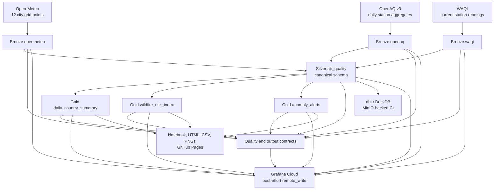

# MediterraneanWillForge Architecture

## Boundary

The maintained system has three real API ingestors, a Delta Lake medallion,
quality and output checks, a dbt/DuckDB validation layer, anomaly reporting,
local MinIO support, hosted B2 automation, and repo-owned report artifacts.



Backblaze B2 is the hosted object store. MinIO provides the same S3-compatible
boundary for local development and CI.

## Pipeline

| Stage | Implementation | Behavior |
|---|---|---|
| Bronze Open-Meteo | `data/ingestion/bronze/copernicus_ingestor.py` | Daily PM2.5, PM10, NO2, and O3 means for 12 CAMS-backed grid points. |
| Bronze OpenAQ | `data/ingestion/bronze/openaq_ingestor.py` | OpenAQ v3 locations and sensor daily aggregates with a per-country cap. |
| Bronze WAQI | `data/ingestion/bronze/waqi_ingestor.py` | Current readings for 15 city searches. A token is required. |
| Silver | `data/ingestion/silver/transformer.py` | Types, bounds, WHO flags, AQI category, completeness, and canonical columns. |
| Gold marts | `data/ingestion/gold/marts.py` | Country summaries and the wildfire risk index. |
| Gold anomaly | `data/ingestion/gold/anomaly.py` | Isolation Forest on concentration-compatible Open-Meteo and OpenAQ rows. |
| Quality | `data/quality/run_checks.py` | Great Expectations checks for requested Bronze and Silver partitions. |
| Output verification | `data/quality/verify_outputs.py` | Gold schema, value-domain, source, and requested-date contracts. |
| dbt | `data/dbt/` | DuckDB models compiled and executed against MinIO in CI. |
| Report | `docs/pipeline_report.ipynb` | Reads Gold, writes the HTML report, readiness CSV, and six charts. |

The scheduled workflow runs daily at 06:00 UTC and defaults to yesterday. A
manual run can target one date or a date range. OpenAQ range ingestion queries
each sensor once for the requested range.

## Tables

| Layer | Path | Partitioning |
|---|---|---|
| Bronze | `s3://{bronze_bucket}/openmeteo/air_quality` | `partition_date` |
| Bronze | `s3://{bronze_bucket}/openaq/air_quality` | `partition_date` |
| Bronze | `s3://{bronze_bucket}/waqi/air_quality` | `partition_date` |
| Silver | `s3://{silver_bucket}/air_quality` | `partition_date`, `source` |
| Gold | `s3://{gold_bucket}/daily_country_summary` | full-table overwrite |
| Gold | `s3://{gold_bucket}/wildfire_risk_index` | full-table overwrite |
| Gold | `s3://{gold_bucket}/anomaly_alerts` | full-table overwrite |

Every retained Delta writer attempts `create_checkpoint()` after writing.
Checkpoint failures are logged as non-fatal, but normal successful writes keep
later B2 table opens from replaying the full transaction log.

## Silver Contract

```text
station_id, station_name, city, country_code, latitude, longitude, date,
pm2_5, pm10, nitrogen_dioxide, ozone, aqi_category,
who_pm25_exceed, who_pm10_exceed, who_no2_exceed, who_o3_exceed,
data_completeness, source, silver_ts, partition_date
```

The source labels are `openmeteo`, `openaq`, and `waqi`. Pollutant names remain
`pm2_5`, `pm10`, `nitrogen_dioxide`, and `ozone`.

WAQI `iaqi` values are index values. They are retained for coverage and general
reporting, but the anomaly model excludes WAQI until a valid conversion to
concentration is implemented.

## dbt

dbt reads Silver Parquet files through DuckDB `httpfs` with Hive partitioning.
The models are a validation and analytics surface in MinIO-backed CI. They are
not materialized by the daily B2 workflow.

Current marts:

- `mart_daily_air_quality`
- `mart_city_weekly_trend`
- `mart_source_coverage`
- `mart_who_exceedance_streak`

## Observability

Pipeline stages publish flat Prometheus metric names. They are pushed to the
local Pushgateway and, when all Grafana credentials are present, to Grafana
Cloud through `data.metrics.push_to_grafana()`.

All network metric pushes are best-effort. Missing, expired, or rejected
observability credentials do not fail ingestion or transformation.

The local Compose stack includes MinIO, Prometheus, Pushgateway, Alertmanager,
and cAdvisor. The hosted dashboard export and managed alert rule reference are
under `grafana/`.

## Automation

| Workflow | Responsibility |
|---|---|
| `ci-data.yml` | Ruff, Black, unit coverage, dbt compile, Compose validation, image builds, MinIO integration, Gold contracts, dbt run/test. |
| `ci-infra.yml` | Prometheus rules/config and Alertmanager validation. |
| `cd-deploy.yml` | Builds and publishes commit-SHA, branch, and latest GHCR images. |
| `pipeline-run.yml` | Runs the real B2 pipeline and verifies requested outputs. |
| `update-report.yml` | Executes the notebook and commits refreshed report artifacts. |
| `pages.yml` | Publishes the committed report through GitHub Pages. |
| `verify-secrets.yml` | Manual, read-only B2 and Grafana credential probes. |
