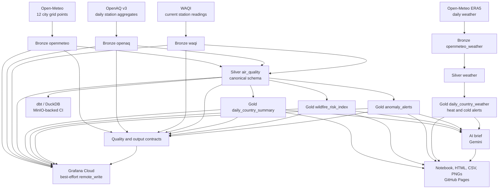

# MediterraneanWillForge Architecture

## Boundary

The system has four API ingestors, a Delta Lake medallion, quality and output
checks, a dbt/DuckDB validation layer, anomaly reporting, a generated daily
brief, local MinIO support, hosted B2 automation, and a report published to
GitHub Pages.


```mermaid
flowchart TD
    OM["Open-Meteo<br/>12 city grid points"]
    OA["OpenAQ v3<br/>daily station aggregates"]
    WQ["WAQI<br/>current station readings"]
    OW["Open-Meteo ERA5<br/>daily weather"]

    BO["Bronze openmeteo"]
    BA["Bronze openaq"]
    BW["Bronze waqi"]
    BX["Bronze openmeteo_weather"]
    SI["Silver air_quality<br/>canonical schema"]
    SX["Silver weather"]
    GD["Gold daily_country_summary"]
    GW["Gold wildfire_risk_index"]
    GA["Gold anomaly_alerts"]
    GX["Gold daily_country_weather<br/>heat and cold alerts"]
    AI["AI brief<br/>Gemini"]
    Q["Quality and output contracts"]
    DBT["dbt / DuckDB<br/>MinIO-backed CI"]
    GC["Grafana Cloud<br/>best-effort remote_write"]
    RP["Notebook, HTML, CSV, PNGs<br/>GitHub Pages"]

    OM --> BO
    OA --> BA
    WQ --> BW
    OW --> BX
    BX --> SX
    SX --> GX
    BO & BA & BW --> SI
    SI --> GD
    SI --> GW
    SI --> GA
    BO & BA & BW & SI --> Q
    GD & GW & GA --> Q
    SI --> DBT
    BO & BA & BW & SI & GD & GW & GA & Q --> GC
    GD & GW & GA & GX --> AI
    GD & GW & GA & GX & AI --> RP
```

Backblaze B2 is the hosted object store. MinIO provides the same S3-compatible
boundary for local development and CI.

## Pipeline

| Stage | Implementation | Behavior |
|---|---|---|
| Bronze Open-Meteo | `data/ingestion/bronze/copernicus_ingestor.py` | Daily PM2.5, PM10, NO2, and O3 means for 12 CAMS-backed grid points. |
| Bronze OpenAQ | `data/ingestion/bronze/openaq_ingestor.py` | OpenAQ v3 locations and sensor daily aggregates with a per-country cap. |
| Bronze WAQI | `data/ingestion/bronze/waqi_ingestor.py` | Current readings for 15 city searches. A token is required. |
| Bronze weather | `data/ingestion/bronze/weather_ingestor.py` | Open-Meteo ERA5 daily weather for the same 12 grid points. |
| Silver | `data/ingestion/silver/transformer.py` | Types, bounds, WHO flags, AQI category, completeness, and canonical columns. |
| Silver weather | `data/ingestion/silver/weather.py` | Condition, wind and dust labels for each station and day. |
| Gold marts | `data/ingestion/gold/marts.py` | Country summaries, the wildfire risk index, and daily country weather with heat and cold alerts. |
| Gold anomaly | `data/ingestion/gold/anomaly.py` | Isolation Forest on concentration-compatible Open-Meteo and OpenAQ rows. |
| Quality | `data/quality/run_checks.py` | Great Expectations checks for requested Bronze and Silver partitions. |
| Output verification | `data/quality/verify_outputs.py` | Runs the Gold data contracts in `data/contracts/` through datacontract-cli, then checks the requested dates. |
| dbt | `data/dbt/` | DuckDB models compiled and executed against MinIO in CI. |
| AI brief | `data/reporting/ai_brief.py` | Anomaly fact-check, country briefings, and the seasonal spotlight from Gemini. |
| Report | `docs/pipeline_report.ipynb` | Reads Gold, writes the HTML report, readiness CSV, and eight charts. The weather chart follows the season set in `data/reporting/season.py`. |

The scheduled workflow runs daily at 06:00 UTC and defaults to yesterday. A
manual run can target one date or a date range. OpenAQ range ingestion queries
each sensor once for the requested range.

## Tables

| Layer | Path | Partitioning |
|---|---|---|
| Bronze | `s3://{bronze_bucket}/openmeteo/air_quality` | `partition_date` |
| Bronze | `s3://{bronze_bucket}/openaq/air_quality` | `partition_date` |
| Bronze | `s3://{bronze_bucket}/waqi/air_quality` | `partition_date` |
| Bronze | `s3://{bronze_bucket}/openmeteo_weather/weather` | `partition_date` |
| Silver | `s3://{silver_bucket}/air_quality` | `partition_date`, `source` |
| Silver | `s3://{silver_bucket}/weather` | `partition_date`, `source` |
| Gold | `s3://{gold_bucket}/daily_country_summary` | rolling window |
| Gold | `s3://{gold_bucket}/wildfire_risk_index` | rolling window |
| Gold | `s3://{gold_bucket}/anomaly_alerts` | rolling window |
| Gold | `s3://{gold_bucket}/daily_country_weather` | rolling window |

Each Gold run reads the latest 60 days of Silver and rewrites the latest 14
days of each table, keeping older rows as they are. `GOLD_WINDOW_DAYS=all`
rebuilds in full, which a backfill needs. The logic is in
`data/ingestion/gold/window.py`.

Every retained Delta writer attempts `create_checkpoint()` after writing.
Checkpoint failures are logged as non-fatal, but normal successful writes keep
later B2 table opens from replaying the full transaction log.

## Silver Contract

```text
station_id, station_name, city, country_code, latitude, longitude, date,
pm2_5, pm10, nitrogen_dioxide, ozone, aqi_category,
who_pm25_exceed, who_pm10_exceed, who_no2_exceed, who_o3_exceed,
data_completeness, source, silver_ts, partition_date
```

The source labels are `openmeteo`, `openaq`, and `waqi`. Pollutant names remain
`pm2_5`, `pm10`, `nitrogen_dioxide`, and `ozone`.

WAQI `iaqi` values are index values. They are retained for coverage and general
reporting, but the anomaly model excludes WAQI until a valid conversion to
concentration is implemented.

## dbt

dbt reads Silver Parquet files through DuckDB `httpfs` with Hive partitioning.
The models are a validation and analytics surface in MinIO-backed CI. They are
not materialized by the daily B2 workflow.

Current marts:

- `mart_daily_air_quality`
- `mart_city_weekly_trend`
- `mart_source_coverage`
- `mart_who_exceedance_streak`

## Observability

Pipeline stages publish flat Prometheus metric names. They are pushed to the
local Pushgateway and, when all Grafana credentials are present, to Grafana
Cloud through `data.metrics.push_to_grafana()`.

All network metric pushes are best-effort. Missing, expired, or rejected
observability credentials do not fail ingestion or transformation.

The local Compose stack includes MinIO, Prometheus, Pushgateway, Alertmanager,
and cAdvisor. The hosted dashboard export and managed alert rule reference are
under `grafana/`.

## Automation

| Workflow | Responsibility |
|---|---|
| `ci-data.yml` | Ruff, Black, unit coverage, dbt compile, Compose validation, image builds, MinIO integration, Gold contracts, dbt run/test. |
| `ci-infra.yml` | Prometheus rules/config and Alertmanager validation. |
| `cd-deploy.yml` | Builds and publishes commit-SHA, branch, and latest GHCR images. |
| `pipeline-run.yml` | Runs the real B2 pipeline and verifies requested outputs. |
| `update-report.yml` | Writes the AI brief, executes the notebook, and publishes the report to GitHub Pages after each successful pipeline run. |
| `verify-secrets.yml` | Manual, read-only B2 and Grafana credential probes. |
